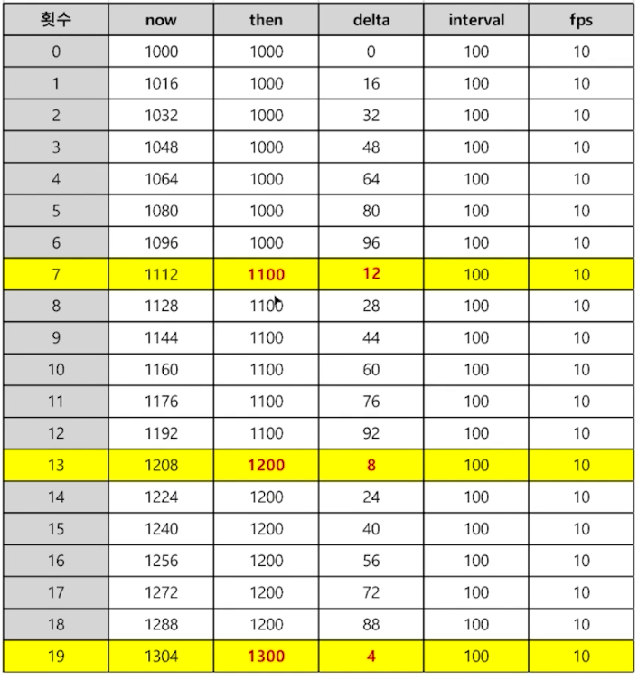

# 1. 모니터의 주사율과 프레임

(1) 144Hz, 60Hz 의 주사율이란?

- window.requestAnimationFrame 에서는 각각 1초에 144번, 60번 실행된다는 것을 의미

(2) 내가 만드는 애니메이션을 1 프레임에 x 를 1px 이동시키는 로직을 만든다면

- 어떤 모니터에서는 144번 실행돼서 144px 만큼 이동하고
- 어떤 모니터에서는 60번 실행돼서 60px 만큼 이동하는 것

(3) 애니메이션을 만들 때는 fps 로 기준을 잡아야 한다.

- 초당 프레임 횟수
- 1초에 requestAnimation 을 몇 번 실행시킬까?
- 자바스크립트 내장 객체인 Date 객체를 활용해서 해결할 수 있다.
- 내 모니터 주사율에 따라 requestAnimationFrame 이 다른 횟수로 실행되지만,
  - fps 로 1초에 함수를 몇 번 실행시킬 것인지 정해서 now 와 then 값의 차이로 모든 모니터에서 동일한 시간에 동일한 움직임을 보여줄 수 있다.

### 예상 시나리오

- 모니터 주사율이 60hz

  - 1초에 60번 실행
  - 약 16ms 마다 requestAnimationFrame 이 실행된다

- 내 애니메이션 목표는 fps = 10
  - 1초에 10번 프레임을 찍을 것
  - 100ms 마다 requestAnimatioFrame 을 실행하라는 의미

- delta 값이 interval 값보다 더 커지면
  - 애니메이션을 동작시킴
  - then = now - (delta % interval)
  - 이렇게 해야 조금씩 차이나는 delta 가 유의미한 시간 차이로 늘어나지 않는다

#
